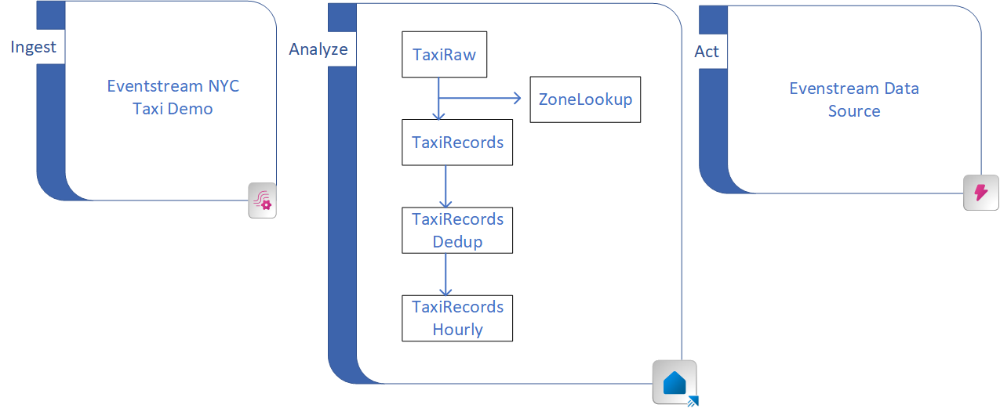
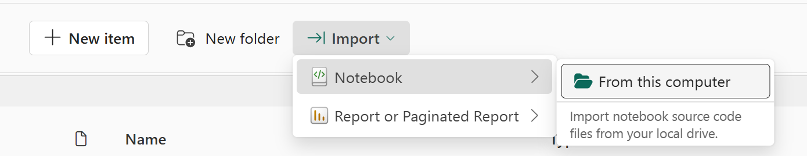

# Microsoft Fabric RTI Demo Application
Microsoft Fabric RTI allows you to ingest, transform, analyze, and act on real time data. Utilizing the [Microsoft Fabric Public APIs]() we are able to deploy a fully functional, end-to-end demo in a minute. After deployment you will have the following architecture ready to explore and demonstrate.

## Ingest
At the ingest layer we utilize the built-in NYC Taxi dataset. We setup an output on this Eventstream to both Eventhouse and Data Activator.

## Analyze
The Analyze layer is made up of Eventhouse and utilization of the Medalion architecture.

- TaxiRaw table contains the raw records coming directly from Eventstream
- ZoneLookup table is a reference table that provides the Neighborhood, Burough, and Zone names according to a location id
- TaxiRecords table is poplulated as records come into the TaxiRaw table via an update policy. This update policy looks up both the pickup and dropoff locatons based on the location id in the raw records
- TaxiRecordsDedup is a Materialized view that makes sure we don't ingest any duplicate records. This view is populated as data comes into the TaxiRecords table.
- TaxiRecordsHourly is a Materialized view that calculates hourly averages as the data comes into the TaxiRecordsDedup MV.

## Act
Data Activator is used to take action on your stream of data. This sample pre-configures the evenstream as a data source for activator. It doesn't setup any actions but is ready for you to configure.

## Deployment
### Option 1: Notebook Deployment
- Either clone this repo or download the notebook file located in the "Deployment Notebook" folder.
- In Microsoft Fabric either create a new workspace or go to an existing workspace. This workspace will need a Fabric Trial, PowerBI Premium, for Fabric License in order to deploy the environment.
- On the workspace click on "Import | Notebook | From this computer" and select "End_to_End_Sample.ipynb"

- Open the newly created notebook and choose "Run All" to kick off the deployment.

### Option 2: Git Integration Deployment

## Details
If you ware interested the notebook is working you can check out the walkthrough which explains how we are using python along with the public api to deploy everything!

[Deployment Details](./Deployment%20Walkthrough/Deployment_Details.md)
